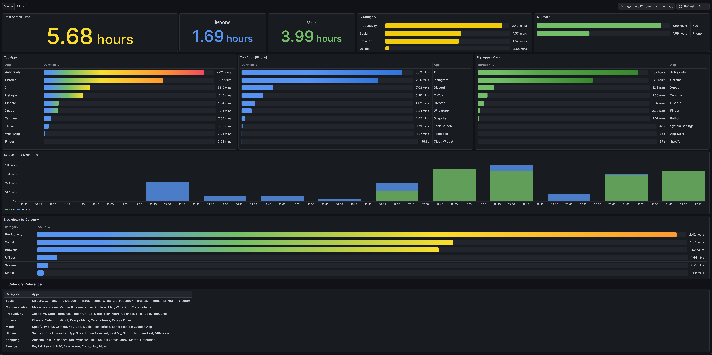
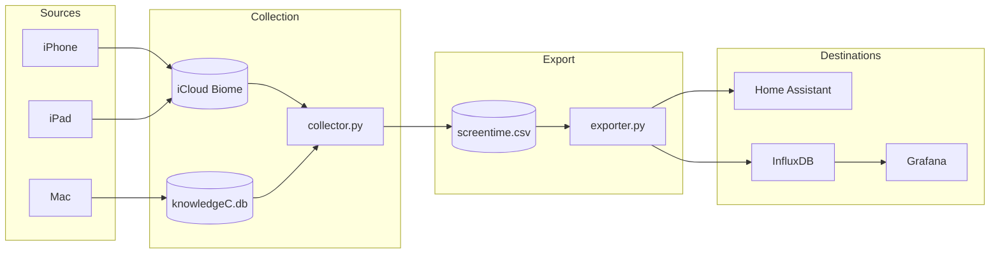

<h1 align="center">Apple Screen Time Exporter</h1>

<p align="center">
  <strong>Own your screen time data.</strong><br>
  Collect, analyze, and visualize your Mac and iOS device usage — without Apple's restrictions.
</p>

<p align="center">
  <a href="https://www.apple.com/macos/"></a>
  <a href="https://www.python.org/"></a>
  <a href="https://opensource.org/licenses/MIT"></a>
</p>

<p align="center">
  <a href="https://www.home-assistant.io/"></a>
  <a href="https://www.influxdata.com/"></a>
  <a href="https://grafana.com/"></a>
</p>

<p align="center">
  <a href="#quick-start">Quick Start</a> •
  <a href="#features">Features</a> •
  <a href="#device-configuration">Configuration</a> •
  <a href="#grafana-dashboard">Dashboard</a> •
  <a href="#troubleshooting">Troubleshooting</a>
</p>

<p align="center">
  
</p>

---

## Features

- **Mac Data** — Reads directly from Apple's `knowledgeC.db` Screen Time database
- **iOS Data** — Syncs iPhone and iPad via iCloud using [aw-import-screentime](https://github.com/ActivityWatch/aw-import-screentime)
- **Multi-Device** — Track multiple iPhones, iPads with custom names
- **Home Assistant** — Creates sensors for dashboards and automations
- **InfluxDB + Grafana** — Long-term storage with beautiful visualizations
- **Deduplication** — Run as often as you want, no duplicate entries
- **Automation** — Built-in launchd support for scheduled collection

---

## How It Works



---

## Quick Start

### Prerequisites

- macOS Ventura, Sonoma, or Sequoia
- Python 3.10+
- iOS devices synced via iCloud
- Terminal with **Full Disk Access**

### Installation

```bash
# Clone the repository
git clone https://github.com/nichtlegacy/screentime.git
cd screentime

# Install aw-import-screentime (for iOS data)
git clone https://github.com/ActivityWatch/aw-import-screentime.git
cd aw-import-screentime && python3 -m venv .venv && .venv/bin/pip install -e . && cd ..

# Install Python dependencies
pip3 install python-dotenv pandas requests

# Configure
cp .env.example .env
```

### Grant Full Disk Access

1. Open **System Settings → Privacy & Security → Full Disk Access**
2. Add **Terminal.app** (from `/Applications/Utilities/`)
3. Restart Terminal

### Run

```bash
python3 run.py
```

<details>
<summary><strong>Example Output</strong></summary>

```
=== Screen Time Collection - 2026-02-08T14:30:00 ===

First run - extracting all available data
[14:30:01] Extracting iPhone 15 Pro data...
[iPhone 15 Pro] 847 new entries found
[14:30:03] Extracting Mac data...
[Mac] 1203 new entries found

  iPhone 15 Pro: 847 Events
  Mac: 1203 Events

Success: 2050 NEW entries added.

=== Screen Time Export - 2026-02-08T14:30:05 ===

--- InfluxDB Export ---
[InfluxDB] 2050 data points written

--- Home Assistant Export ---
[HA] sensor.screentime_total = 245.5
[HA] sensor.screentime_iphone_15_pro = 180.0
[HA] sensor.screentime_mac = 65.5

Export completed.
```

</details>

---

## Device Configuration

### Finding Device IDs

```bash
cd aw-import-screentime && .venv/bin/aw-import-screentime devices
```

Test each device to identify it:

```bash
.venv/bin/aw-import-screentime events preview --device DEVICE-ID-HERE --since 1d
```

### Single Device

```env
DEVICE_ID=CA06AED8-XXXX-XXXX-XXXX-XXXXXXXXXXXX
```

### Multiple Devices

```env
# Format: Name:UUID,Name:UUID
DEVICES=iPhone 15 Pro:CA06AED8-...,iPad Pro:51FBF7C3-...,iPhone Work:7B2A9F1C-...
```

Each device appears separately in the dashboard and Home Assistant.

### Full Configuration

```env
# === iOS Devices ===
DEVICE_ID=CA06AED8-XXXX-XXXX-XXXX-XXXXXXXXXXXX
# Or for multiple: DEVICES=iPhone 15 Pro:UUID1,iPad:UUID2

# === Home Assistant ===
HA_URL=http://homeassistant.local:8123
HA_TOKEN=your-long-lived-access-token

# === InfluxDB ===
INFLUX_URL=http://localhost:8086
INFLUX_TOKEN=your-influx-token
INFLUX_ORG=home
INFLUX_BUCKET=screentime
```

---

## Home Assistant Integration

Sensors are created dynamically based on your configured devices:

| Sensor | Description |
|--------|-------------|
| `sensor.screentime_total` | Total screen time today (minutes) |
| `sensor.screentime_<device>` | Per-device usage (e.g., `screentime_iphone_15_pro`) |
| `sensor.screentime_top_app` | Most used app today |
| `sensor.screentime_by_category` | Breakdown by category |
| `sensor.screentime_top_apps` | Top 10 apps |

<details>
<summary><strong>Creating a Home Assistant Token</strong></summary>

1. Open Home Assistant → Profile → **Security**
2. Under **Long-lived access tokens**, click **Create Token**
3. Name it and copy the token to your `.env`

</details>

---

## InfluxDB Setup

<details>
<summary><strong>Setting up InfluxDB 2.x</strong></summary>

1. Install InfluxDB 2.x (Docker, Unraid, or native)
2. Create a bucket named `screentime`
3. Generate an API token with read/write access
4. Add credentials to `.env`

</details>

---

## Grafana Dashboard

<p align="center">
  
</p>

### Import

1. Open Grafana → **Dashboards** → **Import**
2. Upload `grafana/screentime-dashboard.json`
3. Select your InfluxDB datasource

### Panels

| Panel | Description |
|-------|-------------|
| **Total / Per-Device** | Screen time stats for each device |
| **Top Apps** | Top 10 apps overall and per device |
| **By Category** | Social, Productivity, Media, etc. |
| **Timeline** | Hourly usage with device stacking |

The **Source** filter dynamically loads all devices from your data.

---

## Automation

Run automatically every 6 hours with launchd:

```bash
cp examples/launchd.plist ~/Library/LaunchAgents/com.apple-screentime-exporter.plist
# Edit paths in the plist file
launchctl bootstrap gui/$(id -u) ~/Library/LaunchAgents/com.apple-screentime-exporter.plist
```

| Action | Command |
|--------|---------|
| Run manually | `python3 run.py` |
| Trigger now | `launchctl kickstart gui/$(id -u)/com.apple-screentime-exporter` |
| Stop | `launchctl bootout gui/$(id -u)/com.apple-screentime-exporter` |
| View logs | `tail -f logs/launchd.log` |

> **Note:** Add your Python binary to Full Disk Access for launchd to work.

---

## Data Schema

### CSV

```csv
timestamp,app,title,duration,source
2026-02-08T14:30:00+01:00,com.google.Chrome,Chrome,45.5,Mac
2026-02-08T14:35:00+01:00,com.zhiliaoapp.musically,TikTok,120.0,iPhone 15 Pro
```

### InfluxDB

```
Measurement: screentime
Tags: source, app, title, category
Fields: duration (seconds)
```

**Categories:** Social, Productivity, Browser, Communication, Media, Utilities, Shopping, Finance, System, Other

---

## Project Structure

```
apple-screentime-exporter/
├── grafana/
│   └── screentime-dashboard.json
├── src/
│   ├── config.py          # App mappings & categories
│   ├── collector.py       # Data collection
│   └── exporter.py        # HA + InfluxDB export
├── examples/
│   └── launchd.plist
├── run.py
└── .env.example
```

---

## Troubleshooting

| Problem | Solution |
|---------|----------|
| `knowledgeC.db not readable` | Grant Full Disk Access to Terminal |
| `Device not found` | Ensure device is synced with iCloud |
| No iOS data | Check if `~/Library/Biome/` exists |
| launchd not working | Add Python to Full Disk Access |
| No devices configured | Set `DEVICE_ID` or `DEVICES` in `.env` |

---

## Credits

- Inspired by [Boaz Sobrado's blog post](https://boazsobrado.com/blog/2025/02/03/how-i-built-a-personal-screen-time-tracker-for-mac-and-iphone-using-claude/)
- iOS data via [aw-import-screentime](https://github.com/ActivityWatch/aw-import-screentime)

---

<p align="center">
  <strong>MIT License</strong> © 2026
</p>
