# 📱 Apple Screen Time Exporter

[](https://www.apple.com/macos/)
[](https://www.python.org/)
[](https://www.home-assistant.io/)
[](https://www.influxdata.com/)
[](https://opensource.org/licenses/MIT)

> **Own your screen time data.** Collect, analyze, and visualize your Mac and iPhone usage — without Apple's restrictions.

```mermaid
flowchart LR
    subgraph Sources
        iPhone[📱 iPhone]
        Mac[🖥️ Mac]
    end

    subgraph Collection
        Biome[(iCloud Biome)]
        KnowledgeDB[(knowledgeC.db)]
        Collector[collector.py]
    end

    subgraph Storage
        CSV[(screentime.csv)]
    end

    subgraph Export
        Exporter[exporter.py]
        HA[🏠 Home Assistant]
        Influx[📊 InfluxDB]
        Grafana[📈 Grafana]
    end

    iPhone --> Biome --> Collector
    Mac --> KnowledgeDB --> Collector
    Collector --> CSV
    CSV --> Exporter
    Exporter --> HA
    Exporter --> Influx --> Grafana
```

<p align="center">
  
</p>



---

## 📑 Table of Contents

- [Features](#-features)
- [Quick Start](#-quick-start)
- [Home Assistant Integration](#-home-assistant-integration)
- [Automation with launchd](#-automation-with-launchd)
- [Data Schema](#-data-schema)
- [Project Structure](#-project-structure)
- [Troubleshooting](#-troubleshooting)
- [Credits](#-credits)

---

## ✨ Features

- **🖥️ Mac Data** — Reads directly from Apple's `knowledgeC.db` Screen Time database
- **📱 iPhone Data** — Syncs via iCloud using [aw-import-screentime](https://github.com/ActivityWatch/aw-import-screentime)
- **🏠 Home Assistant** — Creates sensors for dashboards and automations
- **📊 InfluxDB + Grafana** — Long-term storage and beautiful visualizations
- **🔄 Deduplication** — Run as often as you want, no duplicate entries
- **⏰ Automation** — Built-in launchd support for scheduled collection

---

## 🚀 Quick Start

### Prerequisites

- macOS Ventura, Sonoma, or Sequoia
- Python 3.10+
- iPhone synced via iCloud
- Terminal with **Full Disk Access**

### Installation

```bash
# Clone the repository
git clone https://github.com/nichtlegacy/apple-screentime-exporter.git
cd apple-screentime-exporter

# Install aw-import-screentime (for iPhone data)
git clone https://github.com/ActivityWatch/aw-import-screentime.git
cd aw-import-screentime
python3 -m venv .venv
.venv/bin/pip install -e .
cd ..

# Install Python dependencies
pip3 install python-dotenv pandas requests

# Copy and configure environment
cp .env.example .env
```

### Grant Full Disk Access

1. Open **System Settings → Privacy & Security → Full Disk Access**
2. Add **Terminal.app** (from `/Applications/Utilities/`)
3. Restart Terminal

### Configure

Edit `.env` with your settings:

<details>
<summary><strong>Finding your iPhone Device ID</strong></summary>

If you have multiple Apple devices, you'll see multiple Device IDs:

```bash
cd aw-import-screentime && .venv/bin/aw-import-screentime devices

# Output:
# Found 4 device(s) for platform 2
# [{"device_id": "CA06AED8-..."}, {"device_id": "51FBF7C3-..."}, ...]
```

**To find the correct one:**

```bash
# Test each device ID to see which has data
.venv/bin/aw-import-screentime events preview --device DEVICE-ID-HERE --since 1d

# The correct iPhone will return events with apps you recognize
# Example output with TikTok, WhatsApp, Instagram = your iPhone ✓
# Empty or unfamiliar apps = wrong device (old iPhone, iPad, etc.)
```

**Pro tip:** The device with the most recent data and apps you use daily is your current iPhone.

</details>

#### Example .env

```env
DEVICE_ID=XXXXXXXX-XXXX-XXXX-XXXX-XXXXXXXXXXXX

HA_URL=http://homeassistant.local:8123
HA_TOKEN=your-long-lived-access-token

# Optional: InfluxDB
INFLUX_URL=http://localhost:8086
INFLUX_TOKEN=your-influx-token
INFLUX_ORG=home
INFLUX_BUCKET=screentime
```

### Run

```bash
python3 run.py
```

<details>
<summary><strong>Example Output</strong></summary>

```
=== Screen Time Collection - 2026-02-08T14:30:00 ===

First run - extracting all available data
[14:30:01] Extracting iPhone data...
[iPhone] 847 new entries found
[14:30:03] Extracting Mac data...
[Mac] 1203 new entries found

  iPhone: 847 Events
  Mac:    1203 Events

Success: 2050 NEW entries added.

=== Screen Time Export - 2026-02-08T14:30:05 ===

First export - all data will be exported
Loaded data: 2050 new entries

--- InfluxDB Export ---
[InfluxDB] 2050 data points written

--- Home Assistant Export ---
[HA] sensor.screentime_total = 245.5
[HA] sensor.screentime_iphone = 180.0
[HA] sensor.screentime_mac = 65.5
[HA] sensor.screentime_top_app = Chrome

Export completed. Last timestamp: 2026-02-08T14:30:00
```

</details>

---

## 🏠 Home Assistant Integration

After running the export, these sensors become available:

| Sensor | Description |
|--------|-------------|
| `sensor.screentime_total` | Total screen time today (minutes) |
| `sensor.screentime_iphone` | iPhone usage (minutes) |
| `sensor.screentime_mac` | Mac usage (minutes) |
| `sensor.screentime_top_app` | Most used app today |
| `sensor.screentime_by_category` | Breakdown by category (attributes) |
| `sensor.screentime_top_apps` | Top 10 apps (attributes) |

<details>
<summary><strong>Creating a Home Assistant Token</strong></summary>

1. Open Home Assistant
2. Click your profile (bottom left) → **Security**
3. Under **Long-lived access tokens**, click **Create Token**
4. Name it (e.g., "screentime") and copy the token

</details>

---

## ⏰ Automation with launchd

Run the exporter every 6 hours automatically:

```bash
# Copy and customize the plist
cp examples/launchd.plist ~/Library/LaunchAgents/com.apple-screentime-exporter.plist
nano ~/Library/LaunchAgents/com.apple-screentime-exporter.plist  # Update paths

# Install (modern syntax)
launchctl bootstrap gui/$(id -u) ~/Library/LaunchAgents/com.apple-screentime-exporter.plist

# Verify
launchctl list | grep screentime
```

> **Important:** For launchd to work, add your Python binary to Full Disk Access.
> Find your path with `which python3` (commonly `/Library/Frameworks/Python.framework/Versions/3.x/bin/python3`)

### Useful Commands

| Action | Command |
|--------|---------|
| Run manually | `python3 run.py` |
| Trigger now | `launchctl kickstart gui/$(id -u)/com.apple-screentime-exporter` |
| Stop automation | `launchctl bootout gui/$(id -u)/com.apple-screentime-exporter` |
| View logs | `tail -f logs/launchd.log` |
| List devices | `cd aw-import-screentime && .venv/bin/aw-import-screentime devices` |

---

## 📊 Data Schema

### Local CSV

```csv
timestamp,app,title,duration,source
2026-02-08T14:30:00+01:00,com.google.Chrome,Chrome,45.5,mac
2026-02-08T14:35:00+01:00,com.zhiliaoapp.musically,TikTok,120.0,iphone
```

### InfluxDB

```
Measurement: screentime
Tags: source, app, title, category
Fields: duration (seconds)
Timestamp: Session start
```

**Categories:** `social`, `productivity`, `browser`, `communication`, `media`, `utilities`, `shopping`, `system`, `other`

---

## 📁 Project Structure

```
apple-screentime-exporter/
├── .github/
│   └── images/
│       └── preview.png           # Project preview image
├── src/
│   ├── collector.py              # Collects data from Mac + iPhone
│   └── exporter.py               # Exports to Home Assistant + InfluxDB
├── examples/
│   └── launchd.plist             # launchd template for automation
├── data/                         # Collected data (gitignored)
│   └── screentime.csv
├── logs/                         # Log files (gitignored)
├── run.py                        # Main entry point
├── .env.example                  # Configuration template
├── .gitignore
├── LICENSE
└── README.md
```

---

## 🔧 Troubleshooting

| Problem | Solution |
|---------|----------|
| `knowledgeC.db not readable` | Grant Full Disk Access to Terminal |
| `Device not found` | Ensure iPhone is synced with the same iCloud account |
| No iPhone data | Check if `~/Library/Biome/` contains data |
| launchd not starting | Verify paths in plist and Full Disk Access for Python |
| `DEVICE_ID not set` | Run `aw-import-screentime devices` to find your ID |

---

## 🙏 Credits

- Inspired by [Boaz Sobrado's blog post](https://boazsobrado.com/blog/2025/02/03/how-i-built-a-personal-screen-time-tracker-for-mac-and-iphone-using-claude/)
- iPhone data extraction via [aw-import-screentime](https://github.com/ActivityWatch/aw-import-screentime)
- Built with [Claude Code](https://claude.ai/code)

---

## 📄 License

MIT © 2026
