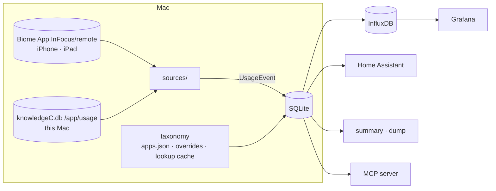

# Architecture

Screen Time Exporter v2 collects Apple Screen Time for every device that syncs
to one Mac, keeps it in a local SQLite database and pushes it to InfluxDB and
Home Assistant. It runs as one launchd agent on the Mac and needs no other
local service.

## Pipeline

`screentime run` (every 15 minutes via launchd) does, under one process lock:

1. **Read sources.** Each enabled source (`sources/`) returns `UsageEvent`s
   newer than the opaque state it returned last time. Sources only read Apple's
   stores; they never write to them.
2. **Import.** Events are upserted into `screen_events` keyed by
   `(device_id, start, bundle_id)`, so re-reading overlaps is harmless. Title
   and category come from the taxonomy at import time.
3. **Aggregate.** Affected local days are rebuilt into `daily_app_stats`,
   `daily_category_stats` and `daily_device_stats`, split at local midnight
   and at 03:00 and 06:00.
4. **Export.** Configured sinks receive the changes: InfluxDB incrementally via
   a cursor, Home Assistant as current-day states
   ([sensor list](home-assistant.md)).

Read-only consumers (`summary`, `dump`, `mcp`; see [cli.md](cli.md) and
[mcp.md](mcp.md)) query SQLite directly.

## Sources

| Source | Data | Device id |
|---|---|---|
| `biome` | iPhone/iPad app focus intervals synced through iCloud, parsed from SEGB files | Biome device UUID; name/model from `Biome/sync/sync.db` |
| `knowledgec` | This Mac's `/app/usage` intervals | `mac:<IOPlatformUUID>` |

The interface lives in `src/screentime/sources/__init__.py`.

## Time semantics

- Storage is UTC. Reporting uses the configured timezone (system default).
- **Late night** is usage between 00:00 and 06:00 local time; **deep night**
  is the 03:00–06:00 part of it. Intervals crossing a boundary are split.
- A day belongs to the local calendar date of each split piece.

## InfluxDB schema

Written by `src/screentime/influx.py`. Every point carries the tags `device`
(display name), `device_id` and `platform` (`iPhone`, `iPad`, `Mac`);
durations are seconds.

| Measurement | One point per | Extra tags | Fields | Time |
|---|---|---|---|---|
| `screentime` | session | `app`, `bundle_id`, `category` | `duration_s` | session start (µs) |
| `screentime_daily` | device · local day | — | `duration_s`, `late_duration_s`, `deep_night_duration_s`, `event_count`, `first_activity_s`, `last_activity_s` | local midnight |
| `screentime_app_daily` | device · local day · app | `app`, `bundle_id`, `category` | `duration_s`, `event_count` | local midnight |
| `screentime_hourly` | device · local hour | `hour` (`00`–`23`), `weekday` (ISO `1`–`7`) | `duration_s` | start of the hour |

`app` is the display name, so one app on several devices groups together.
`first_activity_s`/`last_activity_s` are wall-clock seconds after local
midnight. The dashboard reads the daily and hourly measurements; sessions are
there for ad-hoc queries.

Export works per (device, local day): days whose aggregates changed since the
last export (cursor on `daily_device_stats.updated_at`) are deleted in
InfluxDB and rewritten, so re-exports never duplicate and remaps or device
renames leave no stale series. `screentime export --from DATE` re-sends every
day from `DATE` without moving the cursor.

## Taxonomy

Each bundle id gets a display name and a category, field by field from the
first source that has one:

1. the user's config (`[apps."<bundle id>"]` `name` / `category`),
2. the shipped `data/apps.json`,
3. the lookup cache: installed Mac apps (Spotlight) or the App Store,
4. a guess from the bundle id (`com.example.myApp` → "My App", "Other").

After each import, at most 200 of the most-used unknown bundle ids are looked
up. First among the apps installed on the Mac (Spotlight; name from
`Info.plist` or the file name, category from `LSApplicationCategoryType`),
then, with `[lookup] enabled` (the default), in batches of 50 against
`https://itunes.apple.com/lookup?bundleId=…&country=<cc>&lang=en_us` in the
storefront of the Mac's region (or `[lookup] country`), with the US store as a
fallback for misses. The short `trackName` becomes the name and the App Store
genre maps to a category.
Results go to the `app_lookup` table: hits are kept, misses are retried after
seven days, and network errors cache nothing and never fail a run. Changed
events are reclassified and their days rebuilt, and a changed `[apps]` section
is reapplied to all stored events on the next run. `screentime remap` reapplies
the taxonomy to all stored events; `screentime apps unknown` lists what still
falls back to a guess. Categories are listed in `CONTRIBUTING.md`.

## Configuration

`~/.config/screentime/config.toml`, written by `screentime setup`
([installation and setup](setup.md)). Environment
variables override it; the v1 names (`INFLUX_*`, `HA_URL`, `HA_TOKEN`) keep
working. Data lives in `~/Library/Application Support/screentime/`, logs in
`~/Library/Logs/screentime/`.

## Privacy

Everything stays on the Mac unless a sink is configured. The optional App Store
lookup sends only bundle ids (and the storefront country) to Apple. Nothing is
sent anywhere else.
